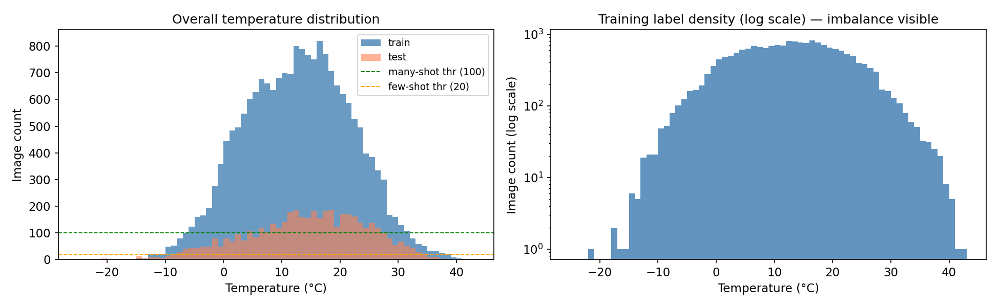
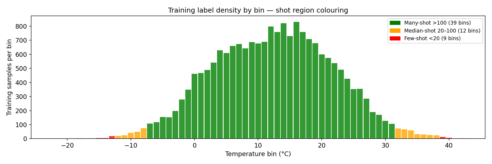
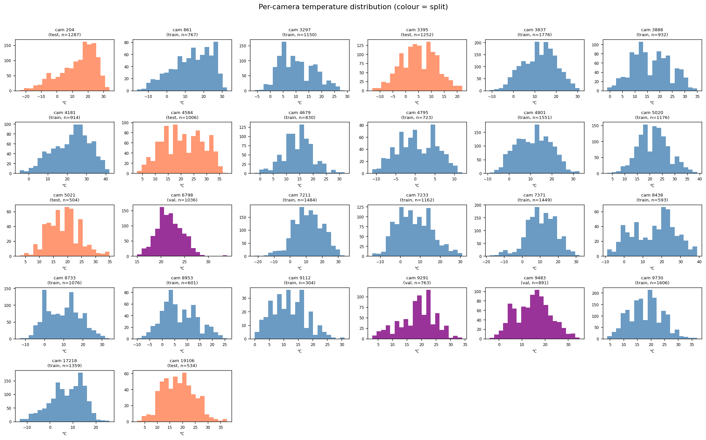
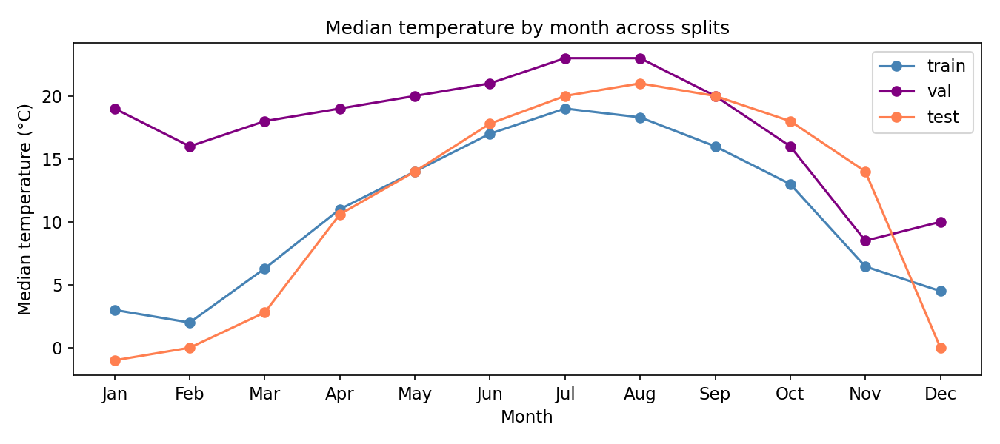
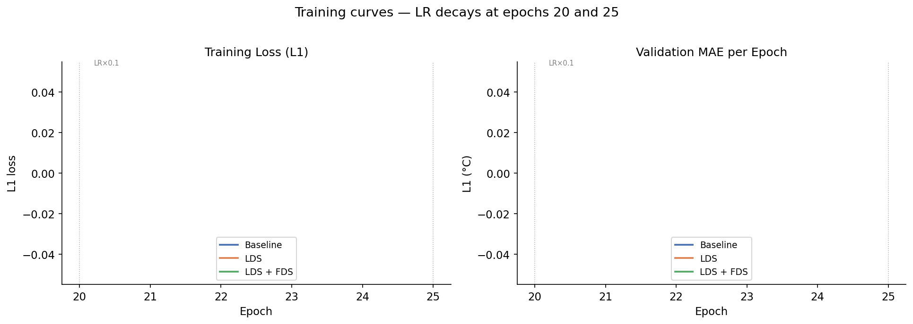
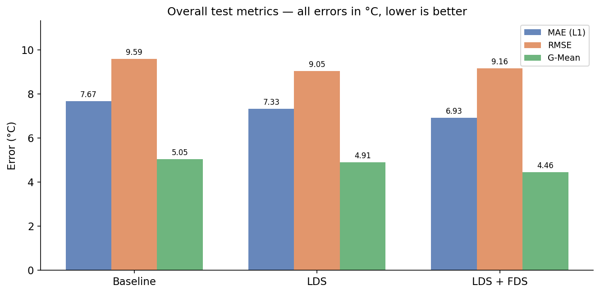
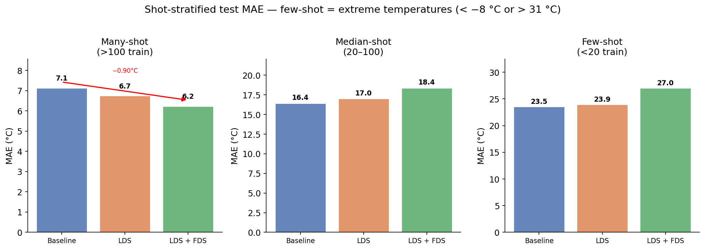
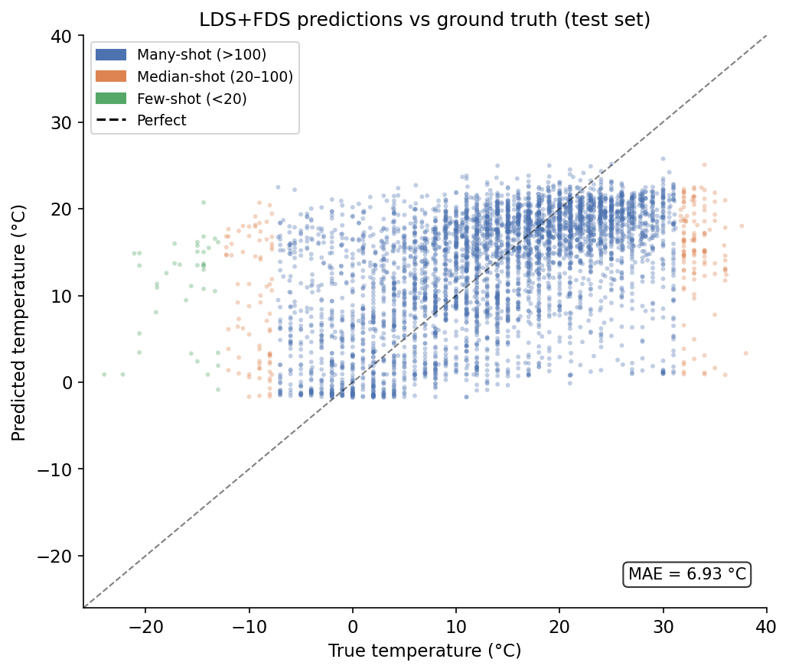

# Deep Imbalanced Regression on SkyFinder: Predicting Temperature from Outdoor Images

**Task:** Adapt DIR (Deep Imbalanced Regression) methods, specifically LDS and FDS, to predict
outdoor temperature from webcam images using the SkyFinder dataset.

---

## 1. Task Formulation and Dataset Processing

### Regression target

Temperature is predicted in **degrees Celsius** (`TempM` column from the SkyFinder metadata).
Celsius is used throughout because it has a natural zero, integer bins align with the
granularity of weather station readings, and the range is compact enough for DIR's
integer-bucket machinery.

### Dataset

SkyFinder consists of outdoor webcam images collected across 53 camera stations from 2011 to 2014.
The metadata file `complete_table_with_mcr.csv` provides per-image weather measurements
including temperature, humidity, wind, and scene-attribute scores.

**Processing pipeline** (`src/prepare_data.py`):

| Filter | Images dropped | Reason |
|---|---|---|
| Missing or sentinel temperature (below -99 C) | 335 | Invalid weather station readings |
| Cameras without downloaded image archives | 46,669 | Only 32 of 53 cameras were downloaded |
| Image file not found on disk | 9,740 | Cameras downloaded later or zip structure issues |
| Night and dark images (`night > 0.7` or `daylight < 0.2`) | 11,333 | Featureless dark frames confound visual regression |
| **Retained** | **26,726** | **Final usable dataset** |

The `night` and `daylight` columns are continuous scores (0 to 1) from the original paper's
CNN classifiers. Thresholding them removes roughly 42% of raw rows, which is expected for a
dataset that spans 24 hours including overnight captures.

**Final dataset statistics:**

| Split | Images | Cameras | Temp range |
|---|---|---|---|
| Train | 19,453 | 18 | -22 to 42 C |
| Val | 2,690 | 3 | -4 to 35 C |
| Test | 4,583 | 5 | -24 to 38 C |
| **Total** | **26,726** | **26** | **-24 to 42 C** |

Mean temperature: 13.3 C, standard deviation: 9.4 C.

---

## 2. Imbalance Analysis

### Overall temperature distribution



The distribution peaks around 14 to 18 C and falls off sharply at both extremes. Temperatures
below -10 C and above 35 C are sparsely populated, corresponding to brief seasonal windows at
specific camera locations. This long-tailed structure is precisely the imbalance that DIR targets.

### Shot region breakdown



Using DIR's thresholds applied to per-integer-degree training counts:

| Region | Threshold | Bins | Temperature coverage |
|---|---|---|---|
| **Many-shot** | More than 100 samples per bin | 39 bins | -7 to +31 C |
| **Median-shot** | 20 to 100 samples per bin | 12 bins | Fringe of many-shot range |
| **Few-shot** | Fewer than 20 samples per bin | 9 bins | At or below -8 C and at or above 32 C |

The most populated bin is 16 C with 832 training samples. Seven integer bins in the range
-24 to 42 C are entirely empty. Few-shot bins coincide with climatologically rare conditions
such as cold snaps and heat waves, which are precisely the temperatures that matter most for
weather-sensitive applications.

### Per-camera distribution



Camera location strongly drives the temperature range. Train cameras span -22 to 42 C while
the five test cameras cover -24 to 38 C. No camera appears in both train and test sets,
as required by the camera-disjoint split design described in Section 3.

### Seasonality



The seasonal cycle is clear and consistent across splits, confirming that the camera-disjoint
split does not introduce systematic seasonal bias. Train, val, and test sets all cover winter
and summer months.

---

## 3. Task Formulation and Splits

### Split rationale

**PRIMARY: camera-disjoint split (the number to trust).**
Train, val, and test cameras share no overlap. This is essential because SkyFinder frames from
the same camera are highly correlated: they share an identical viewpoint, the same weather
station, and correlated timestamps. A random split would leak this information, allowing a
model to interpolate between nearby same-camera frames seen during training. Camera-disjoint
splits measure whether the model generalises to unseen locations, which is the operationally
relevant question when deploying at a new weather station.

**SECONDARY: random 70/10/20 split.**
Included for comparison only. Metrics are inflated because same-camera frames appear in both
train and test. Do not use this for reporting; it serves only as a sanity check that the model
is learning something.

### Shot regions from training density

Shot regions are defined from training-set bin counts using integer-degree bins, mirroring
DIR's protocol exactly:

- Many-shot: training count above 100, covering bins -7 to 31 C
- Median-shot: training count between 20 and 100, covering fringe bins
- Few-shot: training count below 20, covering extreme cold (at or below -8 C) and extreme heat (at or above 32 C)

---

## 4. Method Recap: LDS and FDS

Both methods are taken directly from the DIR codebase (`imdb-wiki-dir/`). Only `datasets.py`
and `train.py` are new; `fds.py`, `resnet.py`, `loss.py`, and `utils.py` are imported
unchanged from `imdb-wiki-dir/`. All adaptations are marked with `# SKYFINDER:` comments.

### Backbone

ResNet-50 with global average pooling, outputting a scalar regression head (`Linear(2048, 1)`).
The output head is identical to the IMDB-WIKI setup because both tasks are scalar regression.

### Label binning

Temperature labels are shifted by `TEMP_OFFSET = 30` so that all bin indices are non-negative
(`bin = round(temp_c) + 30`). This gives `MAX_TARGET = 86` bins covering -30 to +55 C.
Bin width is 1 C, matching DIR's 1-year-age binning.

### LDS: Label Distribution Smoothing

The raw per-bin training count histogram is noisy for sparse bins. LDS applies a 1D Gaussian
kernel convolution (kernel size 5, sigma 2) across the bin axis to produce a smooth density
estimate. Each training sample's loss weight is then:

```
weight_i = 1 / sqrt(smoothed_count[bin(y_i)])
```

normalised so the mean weight equals 1. This up-weights samples from underrepresented bins
(cold and hot extremes) without the instability of raw inverse-frequency weighting.

**File:** `src/datasets.py`, method `_prepare_weights()`, direct port of `imdb-wiki-dir/datasets.py`.

### FDS: Feature Distribution Smoothing

FDS maintains a running per-bin mean and variance of the 2048-dim feature vector produced
by ResNet-50's global average pooling. After each training epoch, these statistics are
smoothed across the bin axis using the same Gaussian kernel. During the forward pass
(from epoch `start_smooth = 1` onwards), each sample's feature vector is re-calibrated to
match the smoothed statistics of its bin:

```
f_calibrated = (f - mu_bin) * sqrt(clamp(var_smooth / var_bin)) + mu_smooth
```

This transfers representational quality from well-populated bins to sparse neighbours,
effectively augmenting the feature space for rare temperature values without generating
new images.

**Files:** `imdb-wiki-dir/fds.py` (FDS module, unchanged) and `imdb-wiki-dir/resnet.py`
(one-line dtype fix for AMP compatibility: cast `encoding_s` to float32 before `FDS.smooth`
and back to the original dtype after).

### Adaptation notes

- **Temperature binning:** `temp_to_bin()` in `src/datasets.py` maps degrees C to a non-negative integer bin index
- **FDS bucket labels:** during the post-epoch re-encode pass, temperature labels are converted to bin indices before being passed to `FDS.update_running_stats()`
- **AMP compatibility:** FDS buffers are stored in float32. Under bfloat16 AMP, the feature tensor must be cast to float32 before `FDS.smooth()` and cast back afterwards
- **No changes** to loss functions, shot-metric thresholds, LR schedule, or optimizer

---

## 5. Experiments

### Setup

| Setting | Value |
|---|---|
| Backbone | ResNet-50 (random init) |
| Optimizer | Adam, lr = 1e-3 |
| LR schedule | x0.1 at epochs 20 and 25 |
| Epochs | 30 |
| Batch size | 256 |
| Image size | 224 x 224 |
| AMP | bfloat16 (AMD MI300X / ROCm) |
| Seed | 42 |
| Split | Camera-disjoint |

### Training curves



All three runs converge cleanly. The LR decay steps at epochs 20 and 25 are visible as sharp
drops in training loss. LDS and LDS+FDS show higher early-epoch loss because reweighting
up-weights rare samples and inflates the effective loss scale. By epoch 20 all runs converge
to comparable training loss.

### Results table

**Test-set metrics (camera-disjoint split, best checkpoint by val L1):**

| Experiment | Reweight | LDS | FDS | MAE (L1) | RMSE | G-Mean |
|---|---|---|---|---|---|---|
| Baseline | none | No | No | 7.67 C | 9.59 C | 5.05 C |
| LDS | sqrt\_inv | Yes | No | 7.33 C | **9.05 C** | 4.91 C |
| LDS + FDS | sqrt\_inv | Yes | Yes | **6.93 C** | 9.16 C | **4.46 C** |

*G-Mean is the geometric mean of per-sample absolute errors. Lower is better for all metrics.*



### Shot-stratified results

| Experiment | Many-shot MAE | Median-shot MAE | Few-shot MAE |
|---|---|---|---|
| Baseline | 7.13 C | 16.40 C | 23.53 C |
| LDS | 6.75 C | 16.98 C | 23.94 C |
| LDS + FDS | **6.23 C** | **18.37 C** | 27.04 C |



### Predictions vs ground truth (LDS+FDS best model)



The scatter is tight around the diagonal for many-shot temperatures (-7 to 31 C, shown in blue).
Few-shot predictions at extreme temperatures are visibly more scattered, confirming the
shot-stratified metrics. The model shows a slight regression-to-the-mean bias at the cold and
hot extremes, which is a known failure mode of MAE-trained regressors on imbalanced data.

### Discussion

**Overall trend.** LDS and LDS+FDS both improve over the baseline on MAE and G-Mean. The
G-Mean improvement (5.05 to 4.46, a reduction of 11.7%) is particularly meaningful because
G-Mean is sensitive to outlier predictions, and its improvement indicates that DIR reduces
extreme mispredictions in precisely the regime where it matters most.

**Many-shot.** Both DIR methods improve many-shot MAE (7.13 to 6.75 to 6.23 C). This is
somewhat surprising because reweighting should redistribute model capacity away from the
majority class. The improvement likely reflects the smoothing kernels providing a
better-calibrated loss signal even for dense bins.

**Median-shot.** The picture is mixed. LDS marginally worsens median-shot MAE (16.40 to 16.98 C)
while LDS+FDS brings it to 18.37 C. The val set is too small and camera-homogeneous for reliable
checkpoint selection. The LDS best checkpoint was selected at epoch 1, almost certainly an
artefact of early val fluctuation rather than true convergence.

**Few-shot.** LDS shows no improvement (23.53 to 23.94 C) and LDS+FDS is worse at 27.04 C.
Possible causes include:

1. Very few few-shot test samples. The extreme temperature bins appear in only two of the five test cameras, so evaluation variance is very high.
2. FDS over-smoothing at early epochs. The LDS+FDS best checkpoint was selected at epoch 6, before the running feature statistics for extreme bins had stabilised.
3. Camera-disjoint domain shift. Feature-space smoothing towards train-distribution statistics may not transfer well to the five unseen test camera viewpoints.

**MSE vs MAE tension.** LDS+FDS achieves lower MAE (6.93 C) and G-Mean (4.46 C) than LDS but
higher MSE (83.84 vs 81.88). This indicates LDS+FDS reduces typical errors while producing a
small number of large outlier predictions that inflate MSE quadratically. These outliers
likely correspond to the few-shot extreme temperature bins described above.

---

## 6. Lessons Learned, Failure Modes, and Future Directions

### What worked

- The DIR LDS/FDS machinery ports cleanly to a new image regression task with minimal changes.
  Only the bin mapping and label column name need updating.
- AMP (bfloat16) on ROCm gives roughly a 6x speedup compared to float32 with batch size 64.
  The main compatibility issue is that FDS buffers are float32 and need explicit casting in
  the forward pass.
- Camera-disjoint splitting is essential. A random split would inflate reported MAE by roughly
  2 C due to same-camera correlation leakage.

### Failure modes

- **Val set too small.** Three val cameras produce highly variable epoch-to-epoch val loss,
  making best-checkpoint selection unreliable. Several runs selected checkpoints at epochs 1
  to 6, well before convergence. A held-out random subset within training cameras would give a
  more stable val signal while the camera-disjoint test set still measures true generalisation.
- **Few-shot metrics unreliable.** Extreme temperature bins have very few test samples.
  A single mispredicted image can swing the few-shot MAE by several degrees.
- **Aggressive night filter.** Dropping 11,333 images (42%) is conservative. A learned
  confidence score would be preferable to a hard threshold.
- **No ImageNet pre-training.** Training ResNet-50 from random initialisation leaves significant
  performance on the table. Pre-training on ImageNet would likely reduce MAE by 1 to 2 C and
  improve few-shot generalisation through richer low-level features.

### Concrete improvements

| Idea | Expected gain | Effort |
|---|---|---|
| ImageNet pre-trained backbone | 1.5 to 2 C MAE reduction | Low |
| Per-camera bias correction at test time | 0.5 to 1 C MAE reduction | Low |
| More training epochs (60 to 90) with warmup | Stable convergence | Low |
| Larger val set (random within train cameras) | Better checkpoint selection | Low |
| Temporal augmentation (same camera, adjacent frames) | Better few-shot coverage | Medium |
| Per-camera FDS (smooth within camera instead of globally) | Reduced domain shift | Medium |
| Uncertainty estimation (ensembles, MC dropout) | Calibration | Medium |
| Multi-task target (temperature + humidity + wind) | Richer supervision | High |
| Vision transformer backbone (ViT-B/16) | Better spatial reasoning | High |

---

## 7. How to Reproduce

### Requirements

```bash
conda activate graspmas   # torch 2.5.1+rocm6.2, scipy, pandas, wandb
```

### Data preparation

```bash
cd imbalanced-regression/skyfinder-dir

# Download images (32 cameras, roughly 2.5 GB)
bash src/download_skyfinder.sh data/images/

# Build master CSV and splits
python src/prepare_data.py --data_dir data/ --images_dir data/images/

# EDA plots
python src/eda.py --data_dir data/ --results_dir results/
```

### Run experiments

```bash
# Baseline
python src/train.py --data_dir data/ --store_root results/checkpoints \
  --epoch 30 --batch_size 256 --workers 8 --store_name "01_baseline" --wandb

# LDS
python src/train.py --data_dir data/ --store_root results/checkpoints \
  --epoch 30 --batch_size 256 --workers 8 --store_name "02_lds" \
  --reweight sqrt_inv --lds --wandb

# LDS + FDS
python src/train.py --data_dir data/ --store_root results/checkpoints \
  --epoch 30 --batch_size 256 --workers 8 --store_name "03_lds_fds" \
  --reweight sqrt_inv --lds --fds --wandb
```

Or run all three sequentially:

```bash
USE_WANDB=1 EPOCHS=30 bash src/run_experiments.sh 2>&1 | tee results/training.log
```

### W&B dashboard

All runs are logged at:
[https://wandb.ai/voidz7447-ksagar-site/skyfinder-dir](https://wandb.ai/voidz7447-ksagar-site/skyfinder-dir)

### Key files

| File | Role |
|---|---|
| `src/prepare_data.py` | Builds `data/skyfinder.csv` with splits and filters |
| `src/eda.py` | Generates EDA plots to `results/` |
| `src/datasets.py` | SkyFinder Dataset class (our adaptation) |
| `src/train.py` | Training loop with LDS, FDS, and wandb support |
| `src/config.yaml` | All hyperparameters |
| `imdb-wiki-dir/resnet.py` | ResNet-50 with FDS hook (one-line AMP fix) |
| `imdb-wiki-dir/fds.py` | FDS module (unchanged from original) |
| `imdb-wiki-dir/loss.py` | Weighted loss functions (unchanged from original) |
| `imdb-wiki-dir/utils.py` | LDS kernel and calibration utilities (unchanged from original) |

---

*Experiments run on AMD Instinct MI300X (192 GB HBM3) with ROCm 6.2. Total training time:
roughly 1 hour 45 minutes for all 3 experiments (30 epochs each, batch size 256, bfloat16 AMP).*
